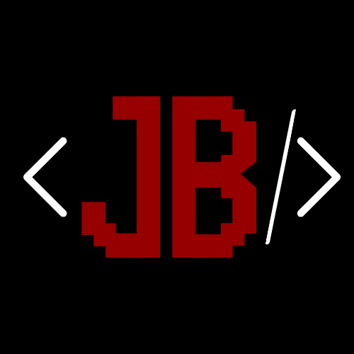

# Salut, moi c'est Justine 👋

Développeuse en alternance sur une application métier en production, et étudiante en
[Bachelor Chef de projet développement et data](https://lamanu.fr/etudes-superieures/bachelor-chef-de-projet-developpement-web-ia/)
à La Manu, campus de Lacroix-Saint-Ouen.

## 💻 Ce que je fais

- 🏢 **En alternance chez [Litesoft](https://www.litesoft.fr/)**, je travaille à temps plein sur un ERP en production :
  reprise de code existant, refonte du moteur de filtres de l'application, migration d'interface, sécurité et
  performance. J'y apprends surtout à être autonome dans une grande base de code d'équipe.
- 🎓 **En Bachelor**, un projet de groupe à quatre : une application web de blind test musical multijoueur en temps réel.
- 🎮 Jeux vidéo, musique, rétro-gaming et univers nerd le reste du temps.

## 🧰 Ma stack

|            |                                                              |
|------------|--------------------------------------------------------------|
| **Back**   | PHP · Node.js · C# · MySQL · PostgreSQL                      |
| **Front**  | JavaScript · React · React Native · Tailwind CSS · Bootstrap |
| **Outils** | Git · Docker · Figma · Postman                               |

## 🚀 Quelques projets

- 🎵 **YABT** : blind test musical multijoueur en temps réel, React et Socket.io, projet de Bachelor à quatre
- 🍔 **Panada Food** : [site vitrine d'un restaurant](https://panadafood.ovh), réalisé en binôme sur six semaines de
  stage

## 📫 Me contacter

- ✉️ **blin.justine.sio@gmail.com**
- 🔗 [LinkedIn](https://www.linkedin.com/in/justine-blin-a88600292)

---

  

